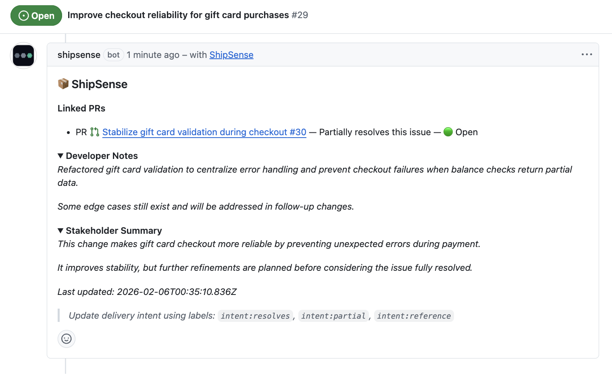
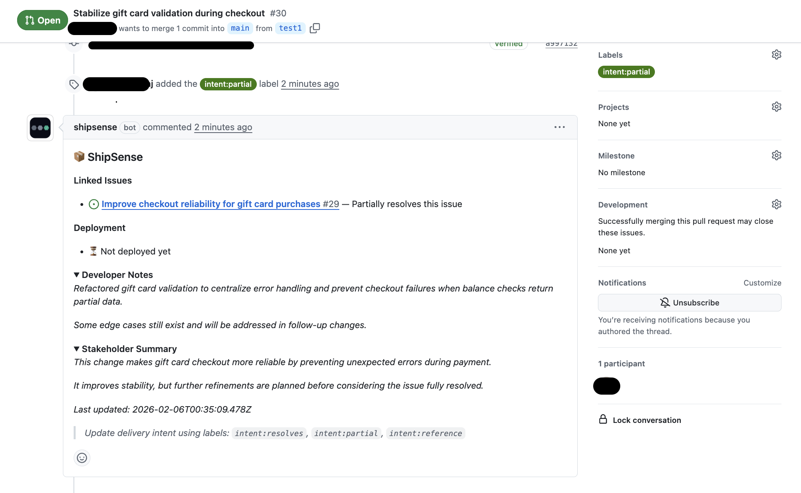

# 📦 ShipSense
### Delivery intelligence inside GitHub — without Jira, spreadsheets, or manual updates.

Built for engineering teams, product managers, and technical leaders who want clear delivery semantics without leaving GitHub.

## Overview

ShipSense is a GitHub App that helps teams understand **what actually shipped** — directly inside GitHub, using the workflows they already use.

Modern teams build in Pull Requests, but delivery understanding lives elsewhere:

- status meetings
- Jira updates
- Slack messages
- manual comments

ShipSense removes that gap by making delivery **explicit, visible, and trustworthy** — using GitHub’s native workflows.

---

## The Problem ShipSense Solves

GitHub provides excellent tools for building software, but it lacks clear delivery semantics.

In real teams:

- A PR may reference an issue but not resolve it
- Multiple PRs may contribute to a single outcome
- Merged does not always mean deployed
- Stakeholders often ask: *“Is this actually done?”*

GitHub offers no structured way to communicate:

- partial delivery
- intent behind a PR
- stakeholder-friendly summaries

ShipSense fills that gap.

---

## Core Idea

> **Not every PR that references an issue resolves it.  
> Not every merge represents a completed delivery.**

ShipSense makes delivery intent **explicit**, not implied.

---

## How ShipSense Works

### 1. Intent-aware Pull Requests

Each Pull Request can declare its intent using simple labels:

- `intent:resolves` → fully completes the issue
- `intent:partial` → delivers meaningful progress
- `intent:reference` → context only

This avoids the ambiguity of overloaded keywords like “Fixes #123”.

---

### 2. Durable PR Documentation

ShipSense adds **one durable bot comment per PR**, continuously updated instead of duplicated.

This comment provides:

- linked issues with delivery intent
- inferred deployment status
- optional developer notes
- optional stakeholder summary (collapsible)

It acts as **living documentation**, not notification noise.

---

### 3. Issue-level Delivery View

Each Issue gets **one ShipSense delivery comment** that acts as a delivery panel:

- linked PRs and their intent
- current delivery state
- an editable **Stakeholder Summary**
- timestamps for trust and traceability

The original Issue description remains human-owned.

---

### 4. Deployment Awareness

ShipSense infers deployment state based on branch merges:

- merges to the configured production branch → *Deployed to Prod (inferred)*
- other merges → visible, but not treated as final delivery

No CI/CD integration required.

---

## Design Principles

ShipSense is intentionally opinionated:

- **Single source of truth**  
  One bot comment per PR. One per Issue.
    
- **Human-owned narrative**
    Stakeholder summaries are editable and preserved.
    
- **Explicit over implicit**
    Delivery intent is declared, not guessed.
    
- **Minimal workflow disruption**
    No CI changes. No extra tools. No forced processes.
    
- **Enterprise-safe defaults**
    Issues are never auto-closed by default.
    

---

## What ShipSense Does *Not* Do

- ❌ Manage CI/CD pipelines
- ❌ Replace Jira or project management tools
- ❌ Replace GitHub Copilot
- ❌ Auto-close issues without review
- ❌ Spam timelines with repeated comments

ShipSense focuses purely on **delivery clarity and communication**.

---

## Why a GitHub App?

ShipSense is built as a GitHub App (not a GitHub Action) to enable:

- centralized logic across repositories
- fine-grained permissions
- long-lived state
- clean evolution toward advanced features

This architecture mirrors how serious internal GitHub tooling is built.

---

## Current Capabilities

- Intent-aware PR ↔ Issue linking
- Partial vs full delivery semantics
- Durable PR documentation
- Durable Issue delivery panels
- Stakeholder-friendly summaries
- Loop-safe, idempotent updates

---

## Future Direction

*These are exploratory directions, not commitments.*

- release-level summaries
- delivery notifications
- richer project integrations
- auditability and compliance features

---

## Why ShipSense Exists

GitHub is excellent at helping teams **build software**,  
but much weaker at helping teams **communicate delivery**.

ShipSense adds that missing layer — without forcing teams out of GitHub.

---

## Availability

- ShipSense is currently a **private GitHub App**
- Not listed on the GitHub Marketplace
- Not open source by design

This project exists to explore delivery intelligence, product design, and GitHub-native workflows.

---
## Screenshots

### Issue-level Delivery View (Stakeholder-focused)

ShipSense provides a single, trusted delivery panel per issue, giving stakeholders clear visibility into progress without modifying the issue description or opening Pull Requests.

- Provides a **single source of truth for delivery status** at the issue level.
- Clearly shows **which Pull Requests contribute** to the issue and **how** they contribute (full resolution, partial delivery, or reference).
- Makes **partial delivery explicit**, avoiding premature issue closure or misleading status.
- Includes an editable **Stakeholder Summary** so non-technical users can understand progress in plain language.
- Preserves the original issue description as **human-owned**, preventing automated overwrites.
- Uses timestamps to ensure delivery information is **current, traceable, and auditable**.

👉 The screenshot answers the core stakeholder question: *“What has shipped, what’s in progress, and what’s still pending?”*

### PR-level Delivery Context (Developer-focused)

ShipSense embeds delivery intent and status directly into Pull Requests, giving developers clear delivery context without interrupting code review.

- Adds **delivery context directly to Pull Requests** without disrupting normal review workflows.
- Uses explicit **intent labels** (`intent:resolves`, `intent:partial`, `intent:reference`) to define how the PR affects delivery.
- Distinguishes **partial delivery** from full resolution, avoiding misleading “Fixes #issue” semantics.
- Keeps stakeholder-facing information **collapsed by default**, minimizing noise for engineers.
- Automatically updates delivery status as PR state or intent labels change — **no manual comments required**.
- Acts as **living documentation** that evolves alongside the Pull Request.

👉 The screenshot answers the developer question: *“What does this PR actually mean for delivery?”*

---

**Version:** v1.0  
**Status:** Feature complete by design